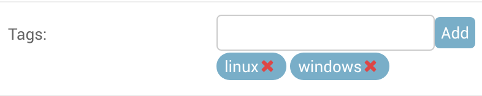

django-array-tags
=================

A simple Tag solution for Django using
`django.contrib.postgres.fields.ArrayField`.

Usage
-----

Add the ArrayField to your model:

    from array_tags.fields import TagField
    from array_tags.managers import TagQuerySet

    class MyModel(models.Model):
        tags = TagField()

        objects = TagQuerySet.as_manager()

Now you have tags!  Values will be stripped and de-duplicated on save.

You can optionally pass `lower=True` to TagField to lower-case all values
before saving.

The model will gain a helper method `get_most_like_by_FIELD` where `FIELD` is
replaced with the name of the field.  This will call the `most_like` method on
the manager, passing the field name and this instances tags.

TagQuerySet
-----------

For convenience, there is also a `TagQuerySet` which adds three methods:

`all_tag_values(name)`

Returns a values queryset of all the tags in the objects in the current
queryset from the TagField named `name`.

`count_tag_values(name)`

Returns a values queryset of tags and how many objects have that tag, from the
current queryset.

`most_like(name, tags)`

Returns a queryset ordered by the number of tags in field `name` found in
`tags`. The number is annotated in `similarity`.

Unnest
------

Finally, there is an additional ORM Function `Unnest` for applying the Postgres
Array function `Unnest` in queries.

Admin Widget
============

Included is a "smart" tag widget for use in Admin.

Unlike other uses, this requires `array_tags` to be included in
`settings.INSTALLED_APPS`.

In your admin.py:

    from django.contrib.postgres.fields import ArrayField
    from array_tags import widgets

    class MyClassAdmin(admin.ModelsAdmin):
        formfield_overrides = {
            ArrayField: {'widget': widgets.AdminTagWidget},
        }

